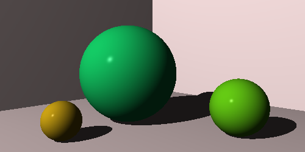

The Ray Tracer Challenge
========================

This repo tracks my progress as I walk through Jamis Buck's book
*The Ray Tracer Challenge: A Test-Driven Guide to Your First 3D Renderer*, which guides readers through implementing a basic ray tracer with a series
of incremental test cases. The book is language-agnostic, so I'm using C++ for my first attempt.

Completed Sections:
-   Tuples, Points, and Vectors
-   Drawing on a Canvas
-   Matrices
-   Matrix Transformations
-   Ray-Sphere Intersections
-   Light and Shading
-   Making a Scene
-   Shadows

Most recently-rendered image:

